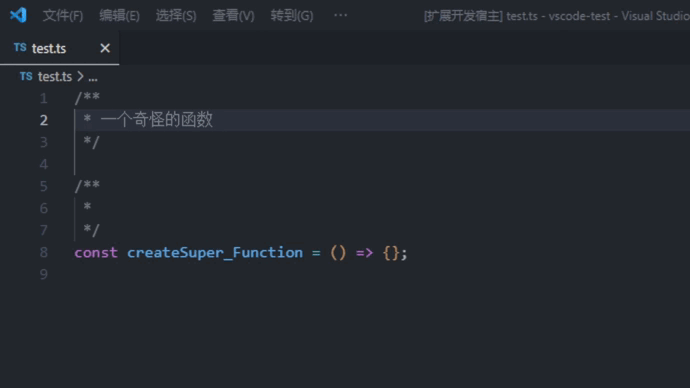
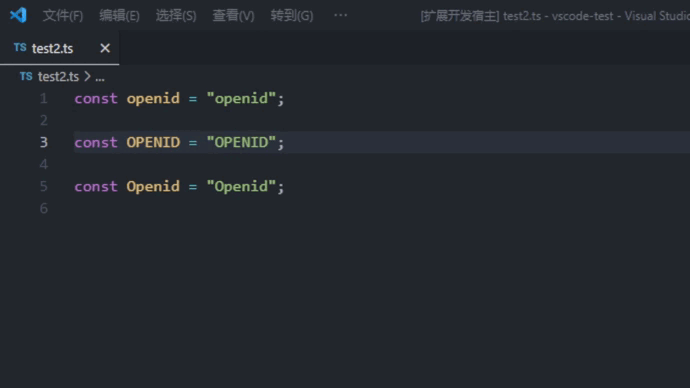
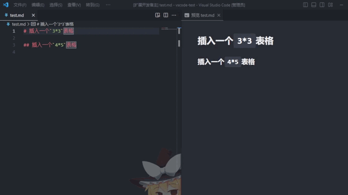
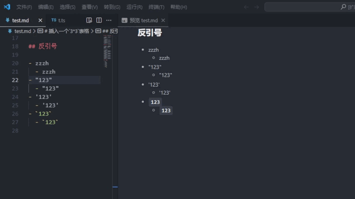
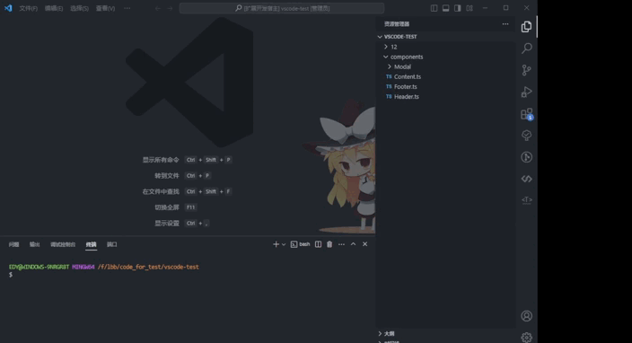

# lin-little-plugin

这是一个`vscode`插件，提供一些小功能。

This is a 'vscode' plugin that provides some small features.

## 百度翻译 `Baidu Translation`

1. 翻译英文 `translate`

    - 快捷键 `ctrl+alt+1`
    - 将翻译结果转成驼峰显示
        - 例如: `加载页逻辑` -> `loadPageLogic`

2. 翻译中文 `translate`

    - 快捷键 `ctrl+alt+2`
    - 支持以下格式
      - `LOAD_TIME_CanSearch` 翻译结果为 `加载时间可以搜索`



### 翻译配置`setting.json`

需要注册百度翻译

```json
  "lin-little-plugin.translate-store-appid": "__APPID__",
  "lin-little-plugin.translate-store-secret": "__SECRET__",
```

## 转换大小写 `Convert Case`

- `lin-little-plugin.transformUpper`
  - 快捷键 `ctrl+alt+3`



## `Markdown`代码片段 `Markdown code snippet`

命令: `markdown`

### `table` 指定行和列的数量即可生成对应的代码片段



## 转换反引号`backtick`

- `lin-little-plugin.backtick`
  - 快捷键 `ctrl+alt+4`



## 创建默认导出文件*index.ts* `exportIndex`

- `lin-little-plugin.exportIndex`
  - 资源管理器右键文件夹


